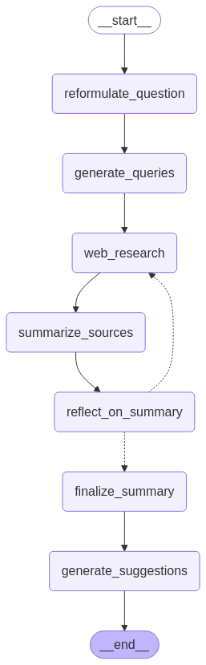

# Ita-Deep-Searcher    
**Ita Deep Searcher** è un assistente di ricerca web avanzato, progettato specificamente per la **lingua italiana** e   
ispirato all'esempio [local-deep-researcher di LangChain](https://github.com/langchain-ai/local-deep-researcher).  
Utilizza **LangGraph** per orchestrare un sistema di **deep search iterativo**, in grado di esplorare a fondo un   
argomento e fornire risposte complete e contestualizzate.  
  
### Come funziona  
Dopo che l’utente inserisce una query o un argomento, il sistema esegue una serie di passaggi strutturati:  
1. **Riformulazione** della query sulla base della cronologia della conversazione.   
2. **Espansione multi-query** per esplorare l’argomento da più angolazioni.  
3. **Ricerca sul web** tramite un motore configurabile, con possibilità di estrarre il contenuto completo delle pagine.  
4. **Riassunto** dei contenuti raccolti per rispondere alla query utente.  
5. **Riflessione automatica** per individuare lacune informative.  
6. **Generazione di nuove query** mirate a colmare le lacune.  
7. **Ripetizione del ciclo** per un numero configurabile di iterazioni.  

Alla fine del processo, viene generato un **riepilogo in formato Markdown**, con:
-   📌 **Citazioni numerate**
-   🔗 **Elenco delle fonti consultate**
-   🧭 **Suggerimenti di approfondimento** (query consigliate)  

  
### 🔎 Cosa cambia rispetto all’originale LangChain
Oltre alla riformulazione dei prompt in lingua italiana, _Ita Deep Searcher_ presenta le seguenti differenze:   
- 🧠 **Short-Term Memory**: gestione della conversazione contestuale, con riformulazione dinamica delle query in base al dialogo precedente.       
- 🔍 **Multi-query intelligente**: genera automaticamente varianti della query iniziale per coprire diverse sfumature dell’argomento.      
- 📄 **Modalità full-content**: estrazione e conversione in Markdown del contenuto completo delle pagine con `readability-lxml` + `markdownify`.      
- 📊 **Reranking dei risultati**: i risultati della ricerca vengono riordinati tenendo conto della pertinenza e del contenuto effettivo delle fonti.      
- 🌐 **Ricerca su dominio specifico**: possibilità di limitare la ricerca a un solo dominio web.      
- 📚 **Risposte con citazioni e fonti numerate**, in stile accademico.      
- 💡 **Suggerimenti finali di approfondimento**: proposte di nuove query per continuare l’esplorazione dell’argomento.  
  
### 🧩 Schema LangGraph  
Ecco il grafo logico implementato dal sistema:
<p align="center">      
      
</p>  
  
### Caratteristiche principali  
 - 🔁 Architettura basata su **LangGraph**  
- 🧠 Supporto a **LLM configurabili**  
- 🔍 **Motori di ricerca** selezionabili: Google, DuckDuckGo, Tavily  
- ⚙️ pzioni di configurazione flessibili:  
    - Opzione per utilizzare il contenuto completo delle pagine (`full-content`), oltre il titolo e lo snippet  
    - Numero di fonti da usare per ogni ciclo di ricerca  
    - Numero massimo di cicli iterativi  
    - Limite di token per ogni fonte (in modalità `full-content`)  
  
 **In sintesi**, Ita Deep Searcher è un ulteriore esempio di **ricerca web profonda**, automatica e trasparente,   
 pensata per ottenere una comprensione approfondita di un argomento **in italiano**,   
 mantenendo tracciabilità delle fonti e supporto al dialogo conversazionale.

### ⚡ Quickstart
Per iniziare rapidamente, puoi:

✅ **Eseguire direttamente** lo script [`main.py`](main.py)

Oppure **copiare il codice d’esempio** seguente nel tuo script Python.

> 🔐 **Importante:** assicurati di creare un file `.env` nella root del progetto con le tue API key.  
> Per OpenRouter, ad esempio:
> 
>```
>.env
>OPENROUTER_API_KEY=sk-xxxxx
>```
💡 **Esempio con OpenRouter**
```python
from dotenv import load_dotenv
from deep_searcher_graph import DeepSearcherGraph
from logger_config import setup_logger
from langchain_core.runnables import RunnableConfig

load_dotenv()
setup_logger()

config = RunnableConfig(
    configurable={
        "search_api": "google",
        "fetch_full_page": True,
        "llm_provider": "openrouter",
        "model_name": "mistralai/mistral-small-24b-instruct-2501:free"
         # "site_search_restriction": "puntosicuro.it",  # opzionale
    }
)

deep_searcher = DeepSearcherGraph(config)
deep_searcher.graph_to_image("graph.png")

result = deep_searcher.invoke("ultime normative europee su intelligenza artificiale")

with open("sommario_finale.md", "w", encoding="utf-8") as f:
    f.write(result["running_summary"])

print("\n\nSOMMARIO")
print(result["running_summary"])
```